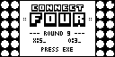

# Connect Four

The Classic Vertical Four-In-A-Row Game

A two player Connect Four game on a much larger board (20 x 7).

Wins will be automatically detected.

The game will keep track of wins for each player throughout multiple rounds, unless you exit the program.

_Requires `PICT7` and `PICT8`_

## Controls

Use arrow keys to move left and right. `EXE` will drop your piece.
Use `MENU` to toggle guide mode. (Drop position will be visualized) `EXIT` allows you to abandon a game.

### Images

