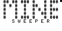
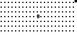

# Minesweeper

The board (21 x 7) contains 17 randomly placed mines by default. If you want to tweak this number, change the first line of code.

Bombs are placed _before_ the first dig, so some games may end very quickly.
Because bombs are placed at random, some games may be impossible to complete without guessing.

## Controls

Use the arrow keys to move.
Use `ALPHA` to dig, and `SHIFT` to flag/unflag.

Pressing `ALPHA` on a blank/number tile will uncover the unflagged tiles directly around it, if the number on the tile matches the number of flags around it.
Use this feature to speed up the process of digging known safe tiles.

## Images

