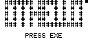
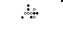

# Othello/Reversi

This version is played on an 7 x 21 board.

Players' wins are recorded over multiple games, until the program is quit.

## Controls

Use the arrow keys to move. Use `ALPHA` or `EXE` to place your piece. Only valid moves will be successful.

Situations where a move is impossible will not be automatically detected. Use `MENU` to skip your turn. Use `EXIT` to end the game.

## Images

