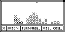
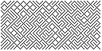
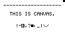
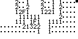
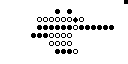
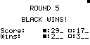
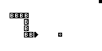
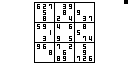

# Casio Graphing Calculator Fx9860 Apps

_A collection of apps and games made for the Casio Fx9860 series of calculators_

These are some of the programs I made in highschool for the Casio Fx9750GII, though they should work for any calculator in the Fx9860 series.

## Gallery

## Installation

For each program, I have provided the G1M file and the source code.

To install a program, you will need to import the G1M file into the [FA-124](https://edu.casio.com/forteachers/er/software/) program for windows. You will need a USB link cable to connect to your calculator. _Some programs require additional picture files, or rely upon other programs to run._

All programs will appear locked on the calculator. This is to prevent accidental code changes when you exit a program.
The passwords are all "`LOCK`".

### About Program Source Code

When a Casio BASIC program is opened in FA-124 for editing, the editor displays unusual characters like `⇒` and `÷` correctly. However, when text is copied out of the editor, it becomes a different unicode character. (`⇒` and `÷` become `×` and `Á`, for example)
To make my source code readable, I've put the text through a substitution cipher to transform _the most common_ of these symbols to unicode equivalents.

If you wanted to transform the source code back into text for the FA-124 editor, you could apply this substitution in reverse, although I would recommend sticking to the G1M file, and making any changes in the FA-124 editor.

Substitutions:

    Ù
    ×	⇒
    Ø	◢
    È	≠
    Ê	≥
    É	≤
    ã	→
    æ	π
    Ë	√
    À	×
    Á	÷
    Î	⁻
    »	⌟
    ä	θ
    ½	𝐢
    ¼	𝗘
    «	x̄

_Note: These aren't all of the characters, only the most common ones._

# More resources

If you want to learn more about Casio BASIC development on the Fx9860, I've found the following resources to be helpful:

- [This](https://community.casiocalc.org/topic/2448-casio-basic-tutorial/) Casio BASIC tutorial forum thread
- Casio's fx-9860G [user manual](https://support.casio.com/storage/en/manual/pdf/EN/004/fx9860GSD_9860G_EN.pdf) (contains a chapter on Casio BASIC programming)
- Tom Lynn's excellent [Casio Graphical Calculator Encyclopedia](http://www.ex-parrot.com/~tom/calcs/calcs/encyc/)
