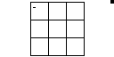
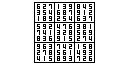

# Sudoku Solver

Input a valid sudoku board, and watch this program brute-force a solution in painfully slow real time.

## Controls

Use the arrow keys to move. Use keys `1` to `9` to fill in cells. `0` will clear a cell.

When all the starter cells have been filled in, use `EXE` to begin searching for a solution. After a solution is found, pressing `EXE` again will find the next solution, if multiple exist.

## Images

